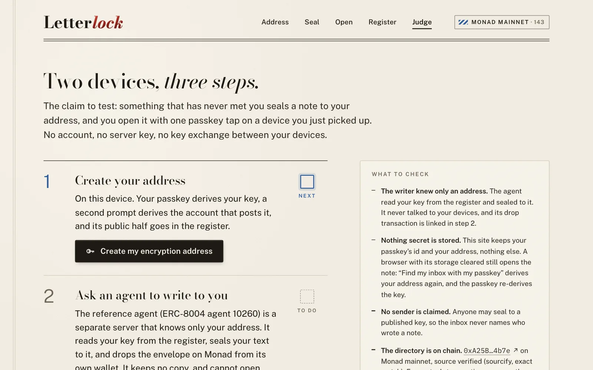

# Letterlock: the judge's script

**The claim to test:** something that has never met you seals a note to your address, and you open it with one
passkey tap on a device you just picked up. No account, no server key, no key exchange between your devices.

Everything below runs on **Monad mainnet** against the Letterlock directory
[`0xA25BBACAb3fD2e71da1Aa002e54965B488d64b7e`](https://monadvision.com/address/0xA25BBACAb3fD2e71da1Aa002e54965B488d64b7e)
(source verified on [Sourcify](https://sourcify-api-monad.blockvision.org/v2/contract/143/0xA25BBACAb3fD2e71da1Aa002e54965B488d64b7e),
exact match), from the live app at **<https://letterlock-app.vercel.app>**.

<p align="center">
  
</p>

## Path A: the judge route (about 2 minutes, a passkey needed)

You need a browser with passkeys whose provider supports the WebAuthn PRF extension (for example iCloud Keychain on a
Mac or iPhone, or Google Password Manager in Chrome). A second device signed in to the same provider is optional,
for step 3.

**Open the link from the submission's judge-access field.** It is
`https://letterlock-app.vercel.app/judge` with a judges' pass that reserves the last 30% of the gas drip's daily cap
for judges. Without the pass, `/judge` works the same in the public lane, which a busy hour can fill. If several
judges share one network, create your addresses a few minutes apart.

| Step | What you do | What you see | What it proves |
|---|---|---|---|
| 1. Create your address | **Create my encryption address**. Two passkey prompts (three on some browsers): the first derives your key, the second the account that posts it. | The gas drip sends your new account enough for one publish; your account publishes the key. Your card shows the key's fingerprint, epoch 1 and the publish transaction, linked to MonadVision. | The key in the register was posted by the account your passkey derives (`msg.sender`), not by a server. Nothing secret is stored: the site keeps your passkey's id and your address. |
| 2. Ask an agent to write to you | Type a note and **Ask the agent**. | The reference agent, ERC-8004 agent 10260 on its own server, reads your key from the register, seals your text and drops the envelope from its own wallet. The page links the drop transaction. | The writer knew only your address. The agent keeps no copy and cannot open what it sealed. |
| 3. Open it here, or somewhere else | **Go to the inbox**, then **Open with passkey**. For the strong version, clear this browser's storage first, or scan the QR code with another device your passkey syncs to. | The inbox lists the letter from the directory's `Dropped` events. One passkey tap: the wax seal cracks and the text rises. | The same passkey re-derives the key on any synced device. **Find my inbox with my passkey** finds your address again on a device that stores nothing. |

Then open **Register**: your line is at the top, newest first, with its transaction. No sender is ever shown: anyone
may seal to a published key, so the inbox never claims who wrote a note.

## Path B: no passkey needed (1 minute)

- **Seal to anyone.** <https://letterlock-app.vercel.app/seal>: type `agent:10260`. The register line that one
  `keyOfAgent` read returned appears (epoch 2, key `e5b3 0e2e 52ec 0dec`). Write a note and press **Seal**: the wax
  presses and the envelope JSON appears. Nothing is sent and no passkey is asked for: sealing is a read and local
  HPKE.
- **The register.** <https://letterlock-app.vercel.app/register> lists every `KeyPublished` event on mainnet with its
  transaction, and says what each key is: the deploy smoke test's demo keys, the agent's rotation to epoch 2, and the
  key a browser's virtual passkey published during the app's live check.
- **An inbox.** <https://letterlock-app.vercel.app/open?to=0x4f48fbc6ea52aeB96e93EfB2464798d18F84463C> shows the
  letter the agent dropped to that passkey account during the live check (its virtual passkey is gone, so it stays
  sealed).
- **From a terminal**, with the SDK's CLI from npm:

  ```sh
  npx letterlock resolve agent:10260                   # the key agent 10260 resolves to: epoch 2, kid e5b30e2e52ec0dec
  echo "hello from a terminal" | npx letterlock seal agent:10260 -   # an envelope only the agent's key opens
  npx letterlock inbox 0xFa72dA61400f345d85BF3d0d55395bDbebDB02b3 --from-block 108289180 --rpc https://rpc1.monad.xyz
  curl -s https://letterlock-agent.vercel.app/health   # the agent's wallet, and the key it holds against the one published
  ```

## What happened on mainnet

Every row is a Monad mainnet transaction whose receipt was read back (status 1) on 2026-09-27. Together they are
every transaction that emitted an event from the directory up to block 108,422,676 (4 `KeyPublished` and 7
`Dropped`, read with `eth_getLogs` from the deploy block), the directory's deploy, the agent's ERC-8004
registration and its owner's one `setAgentURI`, and the two gas drips the drip wallet sent that day. Left out: the
transfers that funded the project's own wallets.

| What | Transaction | Block | From |
|---|---|---|---|
| The directory is deployed | [`0x9766a31c…0a03`](https://monadvision.com/tx/0x9766a31cb8910e2d1f953176454230e51388acd91fc78dc589b406d15b8f0a03) | 108,289,180 | deployer |
| ERC-8004 agent 10260 is registered | [`0xb6b41dd5…6cf1`](https://monadvision.com/tx/0xb6b41dd5800042005b96b46d8245f0311b6461bc5cdbc90347952c3393896cf1) | 108,289,775 | deployer |
| Smoke test: a demo key published, then a note dropped to it and opened | [`0x35b8330e…e233`](https://monadvision.com/tx/0x35b8330e768a6c7529c0c9c4151d945ed83e3ef596c0c6ddca3486efe11ae233), [`0x616fe1a9…3659`](https://monadvision.com/tx/0x616fe1a946d1b90461ffd8284be4881f8650799166526c2d22523053bff93659) | 108,289,847 and 108,289,909 | deployer |
| Smoke test: a demo key for agent 10260, epoch 1 (`publishForAgent`); the register shows it superseded by epoch 2 | [`0x3a5be1d8…0c26`](https://monadvision.com/tx/0x3a5be1d8643029ded9158bf36d73cd1cac4f4a9f24296ac55518539237e80c26) | 108,289,878 | deployer |
| The agent's own key, epoch 2 (`publishForAgent`) | [`0x072dc08d…294b`](https://monadvision.com/tx/0x072dc08d72aefacbe3fe05fedd2296c857c1181fbfa9f548c7ed9322594c294b) | 108,354,286 | the agent's owner |
| `POST /remember` on the live agent: a sealed note dropped | [`0x00fdfadc…fbcd`](https://monadvision.com/tx/0x00fdfadca4afca918ac9ef3a648c491c407e945c2a949041cb24bfe65a4dfbcd) | 108,355,044 | agent wallet |
| `POST /task`: a task sealed to `agent:10260`, opened by the agent, answered sealed to the sender | [`0x59d435ff…2640`](https://monadvision.com/tx/0x59d435ff0295a3e64af43ad9ab2454bca985fb37571bbd194fae7c29d83e2640) | 108,355,072 | agent wallet |
| The app's first live check: a drip that covered the publish at the gas price but not at its fee cap, so the publish never landed ([docs/DX.md](docs/DX.md), hard part 4) | [`0x256047f0…97f1`](https://monadvision.com/tx/0x256047f0073ec3b15656509491b7b433b9b12b75ec4012ed86f68d8dfc4397f1) | 108,359,720 | drip wallet |
| Judge step 2 through the production page | [`0x1262552c…746c`](https://monadvision.com/tx/0x1262552cec61bfa3f46a5357653ac55ddd39512e4a4a20a46aeae86bd57e746c) | 108,366,790 | agent wallet |
| `POST /remember`, checking the first deploy of the agent's per-drop spending checks | [`0x0b2f0989…a0f3`](https://monadvision.com/tx/0x0b2f0989c06b2e54092d25231e6af0f52cb1a740c3c3d2e50404c30444a3a0f3) | 108,369,993 | agent wallet |
| `POST /remember`, checking the deploy that checks each drop as it signs it ([its README](examples/agent-memory/README.md#live-on-mainnet)) | [`0x7d349cf0…2177`](https://monadvision.com/tx/0x7d349cf09186f503dba730b06dbdfef182ff643114de0a00cb1a957ad1862177) | 108,371,264 | agent wallet |
| The app's second live check, 1 of 3: the gas drip to a new passkey account | [`0x2d9646ea…2acb`](https://monadvision.com/tx/0x2d9646ea1c6d9833ae2642f184016dda9b1dbb0e93ab723eb08318c480a62acb) | 108,386,048 | drip wallet |
| 2 of 3: that account publishes its own key (the first the deployer did not post) | [`0xd49f8811…7ddf`](https://monadvision.com/tx/0xd49f881173dc3d3c2ab9cb8bb50b58dd090b3e13300715169d171844f2187ddf) | 108,386,054 | the passkey account |
| 3 of 3: the agent writes to it; the note opened from the inbox, and again with storage cleared | [`0x44428957…02d9`](https://monadvision.com/tx/0x44428957ac2831cc02792d212e5adc802310e73f7b989b7822eb2c793d0602d9) | 108,386,081 | agent wallet |
| The agent's owner sets its card URL again, the same URL, so ERC-8004 indexers fetch the live card | [`0x92789014…5719`](https://monadvision.com/tx/0x9278901488bb444d7b09ebaf9746d02fd49568d6298dc7d2c8106e6b56a65719) | 108,391,548 | the agent's owner |

The live checks drove the production site in Chromium with a WebAuthn virtual authenticator that supports PRF, so
mera's own client ran every ceremony. Their record is [apps/demo/e2e-results/mainnet-live.json](apps/demo/e2e-results/mainnet-live.json);
the whole flow on testnet, with a rotation and the `TAMPERED`, `PASSKEY_FAILED` and `PRF_UNSUPPORTED` slips, is in
[apps/demo/e2e-results/testnet.json](apps/demo/e2e-results/testnet.json).

## Reproduce the proof

```sh
git clone --recurse-submodules https://github.com/edycutjong/letterlock && cd letterlock
pnpm install         # Node 22.18 or later, pnpm 10; Foundry for the contract and chain tests
pnpm verify          # every suite, then one screen of exact counts
pnpm bench           # resolve + seal against Monad mainnet, 5 runs of 200
pnpm readiness       # the submission checklist
```

`pnpm verify` in a fresh clone on 2026-09-27 (Node v22.22.0, forge 1.8.3), 705 passed, 0 failed, 12 skipped:

| Step | Passed | Skipped |
|---|---|---|
| SDK: unit and anvil chain tests (vitest) | 222 | 9 (the live-RPC checks, run with `LIVE=1`: 9 of 9 passed) |
| Contracts: unit, fuzz, invariant, fork, gas (forge) | 111 | 0 |
| PRF spike: unit | 27 | 3 (that no file, commit or commit message names one of the author's private planning notes: they read that folder, next to the author's copy only, and pass 3 of 3 there) |
| App | 99 | 0 |
| Reference agent, with anvil | 95 | 0 |
| Offline seal and open, with the network taken away by the OS | 73 | 0 |
| Scripts: the seed script on anvil, the network guards | 32 | 0 |
| Readiness checks | 46 | 0 |

In the author's copy, next to the planning folder, the same run gives 708 passed, 0 failed, 9 skipped. CI runs the
same command on Ubuntu, with the offline proof in a network namespace; run locally with `act` on 2026-09-27, it gave
the fresh-clone counts above.

`pnpm bench` on 2026-09-27 against the public RPC, N = 1,000 (5 runs of 200):
**resolve + seal p50 25.578 ms, p95 29.636 ms, p99 32.436 ms**. Sealing alone took p50 3.534 ms; resolve alone,
one `keyOf` read, p50 21.969 ms, next to a plain `eth_blockNumber` round trip at p50 19.914 ms. Across the 5 runs the
resolve + seal p50 ranged 25.489–25.789 ms. The method, the machine and every sample are in
[bench/RESULTS.md](bench/RESULTS.md) and [bench/results.json](bench/results.json).
