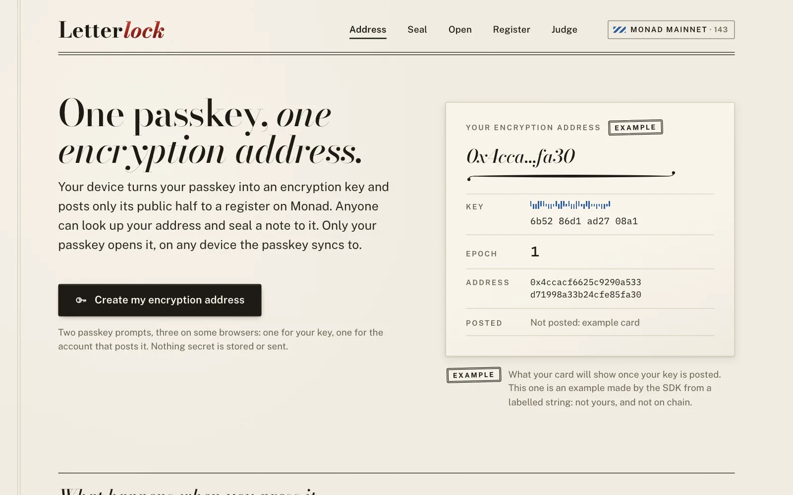
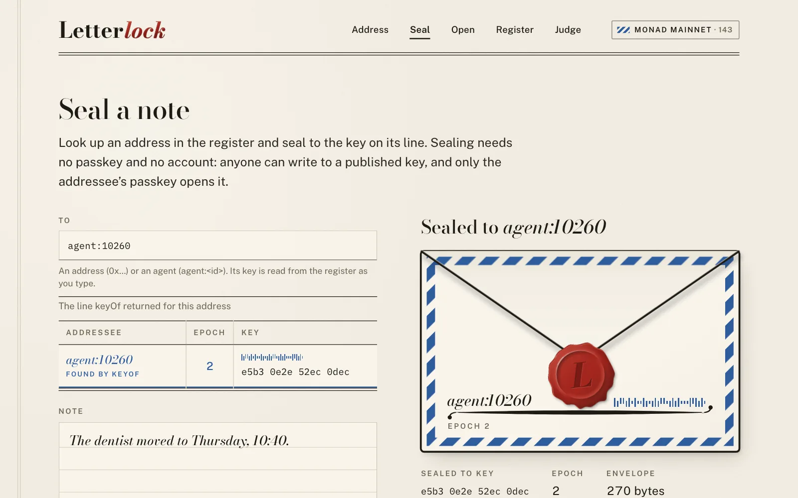
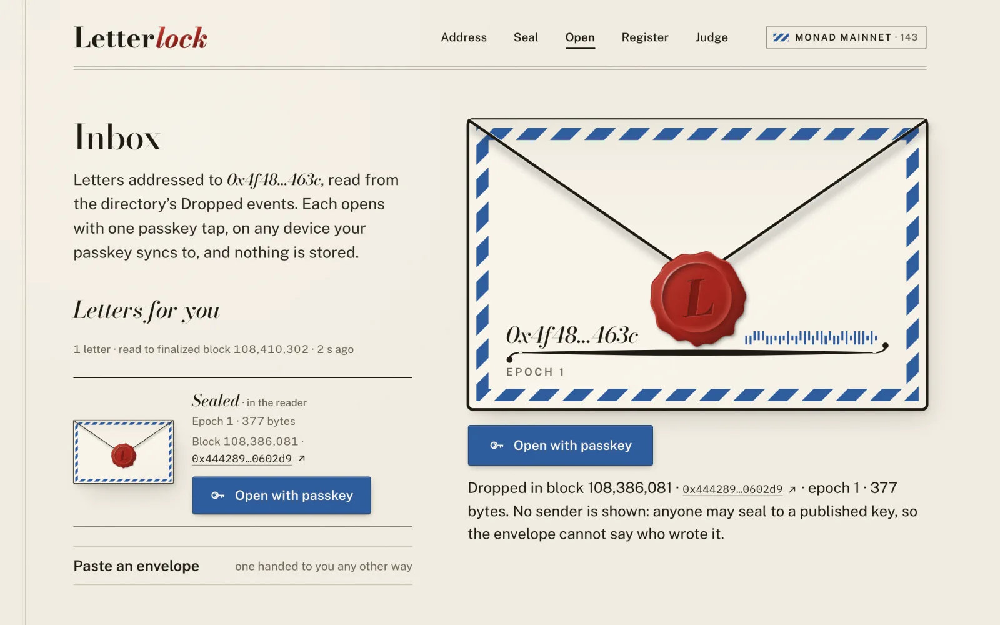
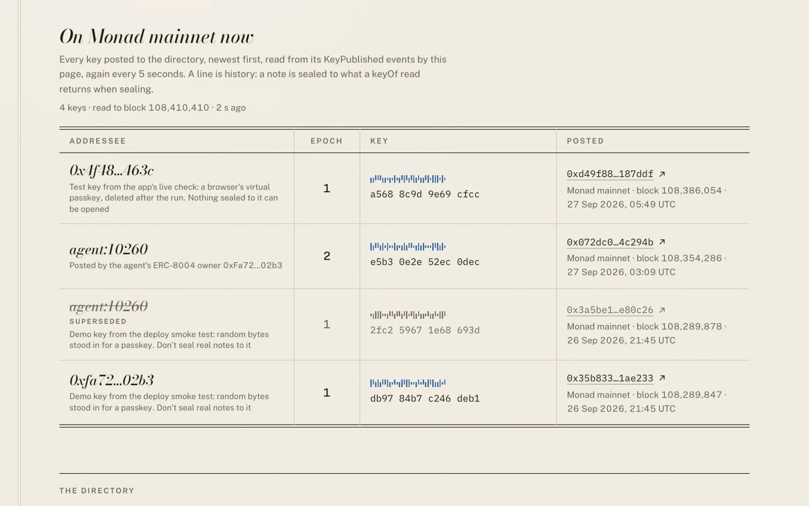
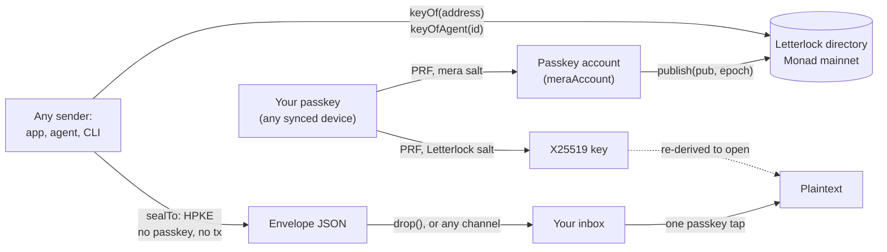

<div align="center">
  
  <h1>Letterlock ✉️</h1>
  <p><em>Any app can seal data only you can open: a passkey becomes an encryption address on Monad.</em></p>
  

  <p>One passkey, one encryption address, on every device the passkey syncs to.</p>

  <p><strong>Live on Monad mainnet.</strong> The directory is Sourcify-verified, resolve + seal p50 25.578 ms over N = 1,000 (<code>pnpm bench</code>), and 705 tests pass in a fresh clone (<code>pnpm verify</code>).</p>

  <br/>

  [](https://letterlock-site.vercel.app)
  [](https://letterlock-site.vercel.app/pitch/)
  [](https://letterlock-app.vercel.app)
  [](DEMO.md)
  [](https://www.npmjs.com/package/letterlock)
  [](https://letterlock-agent.vercel.app)
  [](https://monad.xyz/developers/hackathons/metropolis)

  <br/>

  
  
  
  
  
  
  
  [](https://www.npmjs.com/package/letterlock)
  [](LICENSE)
  [](https://github.com/edycutjong/letterlock/actions/workflows/ci.yml)

</div>

---

## 📸 See it in Action

<table>
  <tr>
    <td width="50%"><br/><sub><b>Address.</b> One button: a passkey, its key, its account, a gas drip, and the key posted to the register.</sub></td>
    <td width="50%"><br/><sub><b>Seal.</b> Type an address or <code>agent:&lt;id&gt;</code>; one <code>keyOf</code> read, then HPKE in the page. No passkey, no transaction.</sub></td>
  </tr>
  <tr>
    <td width="50%"><br/><sub><b>Open.</b> The inbox is the directory's <code>Dropped</code> events. One passkey tap cracks the seal, on any synced device.</sub></td>
    <td width="50%"><br/><sub><b>Register.</b> Every <code>KeyPublished</code> event on mainnet, each linked to its transaction and labelled for what it is.</sub></td>
  </tr>
</table>

Screenshots of the production app on Monad mainnet, 2026-09-27. The note in the second one was sealed in the page to
the reference agent's published key and never sent.

## 💡 The Problem & Solution

### The Problem

Every app that holds something private (a note, a medical record, an agent's memory of you) asks you to trust its
server with it, because there is no way to encrypt to a person without first exchanging keys with them. PGP asked
people to manage keys, and they did not. Wallet addresses name a person on chain, but a wallet key is for signing:
nobody can encrypt to it, and it does not follow you from your laptop to the phone you just picked up.

### The Solution

Letterlock turns the passkey you already have into an **encryption address**. Your device derives an X25519 key from
the passkey's WebAuthn PRF output and publishes only the public half to a directory contract on Monad. Anyone (an
app, a server, an AI agent) looks your address up with one `keyOf` read and seals data to it with HPKE (RFC 9180).
Only your passkey opens it, on any device the passkey syncs to. Nothing secret is stored anywhere, the sender needs no
key exchange with you, and ERC-8004 agents get addresses of their own (`agent:<id>`).

## 🏗️ Architecture & Tech Stack



The directory stores public keys only; `drop` emits an envelope as an event and stores nothing. The parts, one note
end to end, and every trust boundary are in [docs/ARCHITECTURE.md](docs/ARCHITECTURE.md); the normative protocol
(derivation, envelope format, contract rules, threat model) is [docs/SPEC.md](docs/SPEC.md).

| Layer | Technology |
|---|---|
| Chain | Monad mainnet (chain 143) and testnet (10143): the Letterlock directory contract, and the ERC-8004 IdentityRegistry for agent keys |
| Contract | Solidity 0.8.33, Foundry (forge 1.8.3): unit, fuzz, invariant and mainnet-fork tests |
| Passkeys | WebAuthn PRF through [mera](https://mera.category.xyz) (`@category-labs/mera` 0.2.0): the key and the passkey's own EVM account |
| Crypto | HPKE RFC 9180 base mode: DHKEM(X25519, HKDF-SHA256), HKDF-SHA256, ChaCha20-Poly1305 (`@hpke/*`), HKDF and X25519 from `@noble` |
| SDK and CLI | TypeScript on viem, published as [`letterlock`](https://www.npmjs.com/package/letterlock) on npm |
| App | Next.js 15, React 19, a nonce CSP, no analytics and no third-party script, on Vercel |
| Agent | A Vercel function: ERC-8004 agent #10260 with a key derived from a seed |

## 🏆 Monad Integration

**Track: Trust, Identity & AI Infrastructure.** Letterlock is identity infrastructure: a public, verifiable map from
an address or an ERC-8004 agent to the key that seals to it, which any app or agent on Monad can read.

What runs on Monad, in the code:

- **The directory contract** ([contracts/src/Letterlock.sol](contracts/src/Letterlock.sol)): `publish`, `publishForAgent`,
  `keyOf`, `keyOfAgent`, `agentKeyRecord`, `drop`, and the `KeyPublished` and `Dropped` events the register and every
  inbox read.
- **The ERC-8004 IdentityRegistry** on Monad mainnet (`0x8004A169FB4a3325136EB29fA0ceB6D2e539a432`): only an agent's
  current `ownerOf` publishes its key, and `keyOfAgent` returns zeros after a transfer or burn, so a note never goes
  to a previous owner. The reference agent is registered there as agent 10260, and its `tokenURI` is the live agent
  card.
- **mera's passkeys**: the same passkey derives the encryption key and, with mera's own salt, the EVM account that
  signs the publish, so `msg.sender` of a key is the passkey itself. The SDK calls `createPasskeyWithPrfOutput`,
  `getPasskeyPrfOutput`, `createSecp256k1SigningSession` and `toViemAccount`.
- **The SDK's chain client** ([packages/letterlock/src/client.ts](packages/letterlock/src/client.ts)): `resolve`,
  `sealTo`, `publish`, `rotate`, `publishForAgent`, `drop` and `inbox`, over viem, with the mainnet and testnet
  directories built in.

Why Monad: a key directory is read on every seal and written once per person per rotation, so it needs reads that
cost nothing and writes that cost little. On mainnet a first publish charged 70,863 gas (0.007228026 MON) and a drop
of a 490-byte envelope 45,780 gas (0.00466956 MON), at 102 gwei. mera gives every passkey a Monad account without a
wallet extension, and the ERC-8004 registry on Monad gives agents an identity to publish keys under. A spike also
verified a passkey's P256 signature with Monad's `0x0100` precompile, the road to an onchain proof that a passkey
vouches for its key (SPEC §7).

**One honest limitation:** a passkey is bound to the site that made it, so people publish and open on the Letterlock
app (`letterlock-app.vercel.app`, the SDK's pinned rpId), and every other app only seals to them.

## ⛓️ Live Deployment

No wallet extension anywhere: looking up a key and sealing are read-only calls, and a new address is posted by its
own passkey account, which a one-time gas drip funds.

| What | Where |
|---|---|
| Directory, Monad mainnet | [`0xA25BBACAb3fD2e71da1Aa002e54965B488d64b7e`](https://monadvision.com/address/0xA25BBACAb3fD2e71da1Aa002e54965B488d64b7e), deployed in block 108,289,180 ([tx](https://monadvision.com/tx/0x9766a31cb8910e2d1f953176454230e51388acd91fc78dc589b406d15b8f0a03)); Sourcify [exact match](https://sourcify-api-monad.blockvision.org/v2/contract/143/0xA25BBACAb3fD2e71da1Aa002e54965B488d64b7e) of the creation and runtime bytecode |
| Directory, Monad testnet | [`0x3Da5f339E20AB7325ffBb9df57Fb5656ca1f8b3a`](https://testnet.monadvision.com/address/0x3Da5f339E20AB7325ffBb9df57Fb5656ca1f8b3a), the same creation code, agent path disabled (no registry on testnet) |
| App | <https://letterlock-app.vercel.app>, the WebAuthn rpId every Letterlock key is derived under |
| Reference agent | <https://letterlock-agent.vercel.app>: ERC-8004 agent 10260 ([card](https://letterlock-agent.vercel.app/.well-known/agent-card.json), `GET /health`) |
| SDK and CLI | [`letterlock@0.1.0`](https://www.npmjs.com/package/letterlock) on npm, published 2026-09-27 |
| Records | [deployments/143.json](deployments/143.json) and [deployments/10143.json](deployments/10143.json): every transaction, the verification, the gas |

Transactions a judge can open:

- A passkey account, made by the app's live check in Chromium with a virtual authenticator, publishes its own key:
  [gas drip](https://monadvision.com/tx/0x2d9646ea1c6d9833ae2642f184016dda9b1dbb0e93ab723eb08318c480a62acb),
  [publish from the passkey account](https://monadvision.com/tx/0xd49f881173dc3d3c2ab9cb8bb50b58dd090b3e13300715169d171844f2187ddf),
  and [the agent's letter to it](https://monadvision.com/tx/0x44428957ac2831cc02792d212e5adc802310e73f7b989b7822eb2c793d0602d9),
  opened from the inbox.
- The agent's own key at epoch 2, [`publishForAgent`](https://monadvision.com/tx/0x072dc08d72aefacbe3fe05fedd2296c857c1181fbfa9f548c7ed9322594c294b),
  and a task sealed to `agent:10260`, opened by the agent and [answered sealed to its sender](https://monadvision.com/tx/0x59d435ff0295a3e64af43ad9ab2454bca985fb37571bbd194fae7c29d83e2640).

The transactions behind each claim, with what each proves, are in [DEMO.md](DEMO.md#what-happened-on-mainnet),
every one that emitted a directory event up to block 108,422,676 among them.

## 📊 Engineering Rigor

| Metric | Value |
|---|---|
| Tests | `pnpm verify` in a fresh clone: 705 passed, 0 failed, 12 skipped, in 8 suites (SDK 222, contracts 111, PRF spike 27, app 99, agent 95, offline 73, scripts 32, readiness 46). Skipped: the SDK's 9 live checks, which pass 9 of 9 with `LIVE=1`, and 3 checks that no file, commit or message names one of the author's private planning notes, which run only next to that folder (there: 708 passed, 9 skipped) |
| Latency | resolve + seal p50 25.578 ms, p95 29.636 ms, p99 32.436 ms against Monad mainnet's public RPC, N = 1,000, 0 failed calls ([bench/RESULTS.md](bench/RESULTS.md)) |
| Sealing cost | seal alone (HPKE, local CPU) p50 3.534 ms |
| Gas, mainnet receipts | publish 70,863 · drop of 490 bytes 45,780 · `publishForAgent` 108,799 (first key) and 74,652 (rotation) |
| Offline proof | seal and open with the network taken away by the OS (`sandbox-exec` on macOS, a network namespace in CI): 73 checks, 14 envelope fixtures replayed |
| Contract | 111 forge tests: unit, fuzz, invariant, mainnet fork against the live registry, gas snapshots |
| End to end | the whole flow on testnet in Chromium with a PRF-capable virtual authenticator, and a live check on mainnet that published a passkey account's key ([records](apps/demo/e2e-results)) |
| Design QA | 25 checks and axe on 6 routes at 1280 and 390 px: 0 failures, 0 violations |
| Secrets | gitleaks over every commit's patch and every commit message ([.gitleaks.toml](.gitleaks.toml); `pnpm readiness` runs both): no leaks. The drip's and the agent's keys live in Vercel's sensitive environment variables and with the operator, never in the repository or a page's bundle |

### Attacks defeated

| Attack | Control | Test |
|---|---|---|
| Re-address an envelope to another chain, directory or recipient | HPKE `info` binds chain id, directory, recipient and epoch | [envelope.test.ts:95](packages/letterlock/test/envelope.test.ts#L95) |
| Edit the unauthenticated `kid` so the right key fails | decrypt first; the `kid` only explains a failure | [envelope.test.ts:71](packages/letterlock/test/envelope.test.ts#L71) |
| Publish a small-order or non-canonical X25519 key | the contract refuses 14 small-order encodings and any u at or above 2^255 − 19 | [Letterlock.t.sol:305](contracts/test/Letterlock.t.sol#L305), [:343](contracts/test/Letterlock.t.sol#L343) |
| Use up an address's epochs, or brick a buyer's agent slot | every epoch is the current one + 1 | [Letterlock.t.sol:246](contracts/test/Letterlock.t.sol#L246), [:450](contracts/test/Letterlock.t.sol#L450) |
| Seal to an agent's previous owner after a transfer | `keyOfAgent` resolves only for the current `ownerOf` | [Letterlock.t.sol:495](contracts/test/Letterlock.t.sol#L495), [invariant](contracts/test/LetterlockInvariant.t.sol#L334) |
| Starve the registry call so "no owner" reads as "no key" | only `ERC721NonexistentToken` means no owner; anything else reverts | [LetterlockRegistryCall.t.sol:66](contracts/test/LetterlockRegistryCall.t.sol#L66), [:135](contracts/test/LetterlockRegistryCall.t.sol#L135) |
| Publish another passkey's key under a passkey account | the client refuses a key that does not name the account's passkey, before signing | [client.test.ts:333](packages/letterlock/test/client.test.ts#L333), [:382](packages/letterlock/test/client.test.ts#L382) |
| Publish a key derived on another origin (localhost, a preview) | one pinned rpId; a key from another rpId is refused | [client.test.ts:483](packages/letterlock/test/client.test.ts#L483) |
| Hand an agent's server the owner's own key | `publishForAgent` takes only a key derived for that agent | [client.test.ts:601](packages/letterlock/test/client.test.ts#L601) |
| Drain the gas drip with fresh accounts, or shut the judges' lane by sending it MON | hourly and daily caps counted from the wallet's own history on chain | [drip.test.ts:334](apps/demo/test/drip.test.ts#L334), [:382](apps/demo/test/drip.test.ts#L382) |
| Drain the agent's wallet with concurrent requests across instances | each drop checked when it is signed, one at a time, counted by nonce | [spend-race.test.ts:105](examples/agent-memory/test/spend-race.test.ts#L105) |
| Replay a task sealed to the agent with your own reply address | the reply address, a nonce and a time are sealed inside the task | [app.test.ts:289](examples/agent-memory/test/app.test.ts#L289) |
| Pass the offline proof with the network still reachable | an OS-level block, and a guard that counts every way out | [no-network.test.ts:78](scripts/test/no-network.test.ts#L78), [os-sandbox.test.ts:92](scripts/test/os-sandbox.test.ts#L92) |

### Honest limits (13)

1. **Anyone can seal to anyone.** HPKE base mode is anonymous, and a copied envelope can be dropped again. The app
   never shows a sender; the agent seals a nonce and a time inside each task.
2. **Metadata is public.** The recipient, the epoch and the timing of every `drop` are on chain.
3. **No recovery.** If every synced copy of the passkey is lost, so is the key.
4. **The rpId's host can derive every key.** Whoever serves `letterlock-app.vercel.app` can run passkey ceremonies
   for it. It is a Vercel project name; a registered domain would be sturdier, and moving takes an SDK release.
5. **Opening happens on the Letterlock app.** A browser lets a page use only its own domain as the rpId, so other
   apps seal and recipients open there.
6. **The RPC is trusted for reads.** The client checks the chain id and the directory's code, but a `keyOf` answer
   carries no state proof: a lying RPC could substitute a key.
7. **A compromised device during an open** exposes that epoch's key. Rotating protects new notes.
8. **The passkey-to-key binding is `msg.sender`.** The P256 proof through `0x0100` worked in a spike and is not
   adopted in the contract.
9. **Two passkey prompts to publish**, three on some browsers: mera 0.2 evaluates one PRF salt per ceremony.
10. **Per-IP limits are per server instance.** The drip's and the agent's in-memory limits are best effort; the
    Vercel firewall limits POSTs per IP for every instance, and the caps that bound spending are read from the chain.
11. **The agent's day is bounded by its wallet.** It spends at most a quarter of its balance a day at the costliest
    drop, and anyone can use that allowance up.
12. **Inbox scans are slow on the default RPC**, 100 blocks per request from the deploy block. Pass `fromBlock`, use
    `rpc1.monad.xyz`, or index `Dropped` yourself.
13. **The first keys in the directory are this project's own**: demo keys from the deploy smoke test (random bytes
    in place of a passkey) and a test key from the app's live check. The register labels each; do not seal real
    notes to them.

## 🚀 Getting Started

### Prerequisites

Node.js 22.18 or later and pnpm 10. [Foundry](https://getfoundry.sh) for the contract tests and the SDK's chain tests
on anvil. A browser with passkeys that support PRF (iCloud Keychain, Google Password Manager) to publish and open.

### Installation

```sh
git clone --recurse-submodules https://github.com/edycutjong/letterlock && cd letterlock
pnpm install
pnpm verify
```

To seal from your own app, `npm i letterlock`:

```ts
import { letterlock } from "letterlock";
const ll = letterlock({ chain: "monad" });
const envelope = await ll.sealTo("agent:10260", new TextEncoder().encode("only its key opens this"));
```

The developer guide, with the CLI, every error code and what was hard on Monad, is [docs/DX.md](docs/DX.md). The app
runs locally with `pnpm --filter letterlock-demo dev`: looking up and sealing work anywhere, while creating and
opening an address happen on the production host, the pinned rpId (a testnet build may make passkeys for `localhost`,
for the end-to-end tests). The agent runs on testnet with the steps in [its README](examples/agent-memory/README.md).

## 🧪 Testing & CI

```sh
pnpm verify                            # every suite, then one screen of exact counts (exit 1 if any fails)
pnpm bench                             # resolve + seal latency against Monad mainnet; gas from receipts
pnpm readiness                         # the submission checklist
pnpm --filter letterlock test:live     # the SDK's read-only checks against Monad mainnet and testnet
```

[CI](.github/workflows/ci.yml) runs `pnpm typecheck` and `pnpm verify` on every push, with Foundry installed and the
offline proof inside a network namespace; [a second workflow](.github/workflows/contracts.yml) checks the contract's
format, gas snapshots, ABI exports and deployment records.

## 📁 Project Structure

```text
contracts/            the directory contract, its tests, the deploy script and runbook
packages/letterlock/  the SDK and CLI (npm: letterlock)
apps/demo/            the app at letterlock-app.vercel.app, with the gas drip
examples/agent-memory/ the reference agent at letterlock-agent.vercel.app (ERC-8004 #10260)
spikes/prf-browser/   the day-one spike: real WebAuthn PRF, and the P256 check against 0x0100
scripts/              verify, bench, the offline proof, seed, readiness
deployments/          the mainnet and testnet records
bench/                results.json (every sample) and RESULTS.md
docs/                 SPEC.md, ARCHITECTURE.md, DX.md
site/                 the landing page and the pitch deck, at letterlock-site.vercel.app
```

## 🗺️ Roadmap

- [x] The protocol, the SDK and the CLI, published to npm
- [x] The directory on Monad mainnet and testnet, verified on Sourcify
- [x] The app on the pinned rpId, every flow live on mainnet, with a gas drip
- [x] The reference agent, ERC-8004 #10260, sealing notes and answering sealed tasks
- [x] Reproducible proof: `pnpm verify`, `pnpm bench`, the offline proof, CI
- [ ] The P256 binding in the contract, so a key proves which passkey vouches for it
- [ ] Recovery: a second passkey, or a social rotation
- [ ] A registered domain for the rpId
- [ ] An indexer for `Dropped`, so an inbox is one request
- [ ] Sender authentication for apps that need it (HPKE auth mode)

## 📽️ Demo Materials

- **Landing page:** <https://letterlock-site.vercel.app>, and the pitch deck at <https://letterlock-site.vercel.app/pitch/> (both in [site/](site))
- **Live app:** <https://letterlock-app.vercel.app>, and the judges' route at <https://letterlock-app.vercel.app/judge>
- **The judge's script:** [DEMO.md](DEMO.md): two paths, every mainnet transaction, and how to reproduce the numbers
- **Reference agent:** <https://letterlock-agent.vercel.app>
- **Benchmark:** [bench/RESULTS.md](bench/RESULTS.md)

## 📄 License

[MIT](LICENSE).

## 🙏 Acknowledgments

[mera](https://mera.category.xyz) by Category Labs for passkey PRF and passkey accounts; the HPKE implementation of
[hpke-js](https://github.com/dajiaji/hpke-js); [@noble](https://paulmillr.com/noble/) curves and hashes;
[viem](https://viem.sh); [Foundry](https://getfoundry.sh); the authors of
[ERC-8004](https://eips.ethereum.org/EIPS/eip-8004); and the Monad team for the chain and the Metropolis hackathon.
