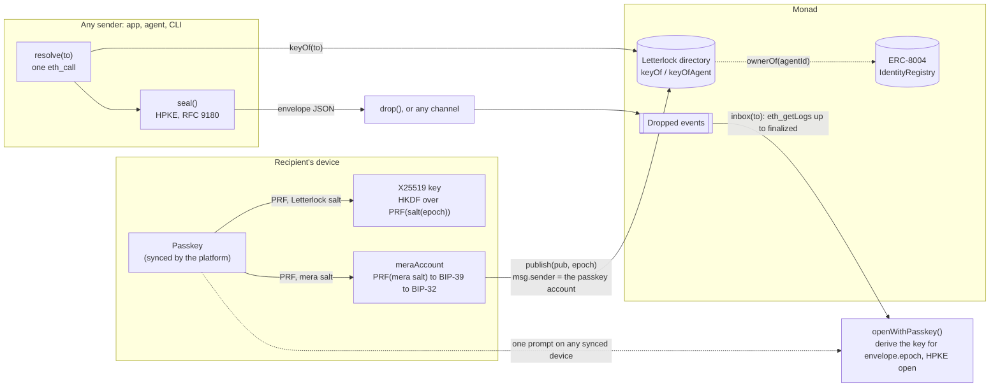
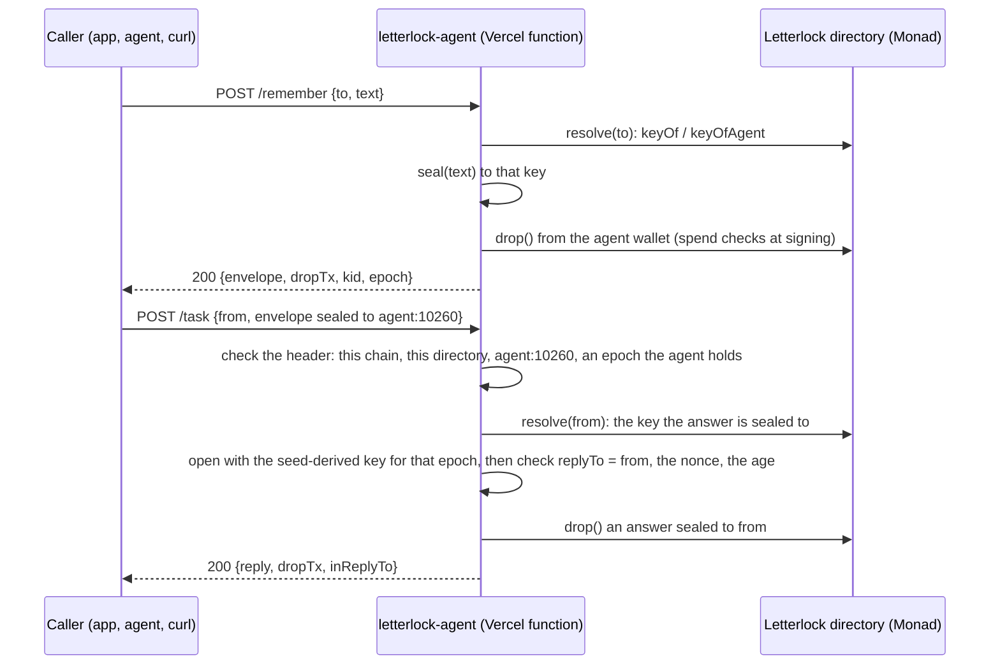

# Architecture

How Letterlock works, read from the code in this repository. The protocol's normative rules (derivation, envelope
format, contract rules) are in [SPEC.md](SPEC.md); this page names the parts, follows one note through them, and
marks where each trust boundary runs.

## The parts

| Part | Path | What it is |
|---|---|---|
| Directory contract | [`contracts/src/Letterlock.sol`](../contracts/src/Letterlock.sol) | One contract on Monad. `publish(pub, epoch)` and `publishForAgent(agentId, pub, epoch)` write an X25519 public key; `keyOf(address)`, `keyOfAgent(agentId)` and `agentKeyRecord(agentId)` read it; `drop(to, toAgent, envelope)` emits an envelope as a `Dropped` event and stores nothing. Keys are checked on the way in (non-zero, not one of the small-order encodings, canonical, epoch = current + 1). The agent path reads the ERC-8004 IdentityRegistry's `ownerOf`. |
| SDK | [`packages/letterlock/src`](../packages/letterlock/src) | TypeScript, published on npm as [`letterlock`](https://www.npmjs.com/package/letterlock). `derive.ts` (PRF output to X25519 key), `passkey.ts` (mera ceremonies), `account.ts` (`meraAccount`: the passkey's EVM account), `envelope.ts` (HPKE seal and open, the wire form), `client.ts` (the chain client), `inbox.ts` (the `Dropped` log scan), `chain-errors.ts` (every failure to a `LetterlockError` code). |
| CLI | [`packages/letterlock/src/cli`](../packages/letterlock/src/cli/program.ts) | `letterlock resolve`, `seal`, `verify`, `inbox`, `drop`: the SDK from a terminal. It handles no key material except `drop`'s signing key, read from an environment variable the command names. |
| App | [`apps/demo`](../apps/demo) | Next.js 15, live at [letterlock-app.vercel.app](https://letterlock-app.vercel.app), the one WebAuthn rpId keys are derived under. Routes `/`, `/seal`, `/open`, `/register`, `/judge`, `/kit`. Every flow calls the SDK in the browser. One server route, `POST /api/drip`, pays a new passkey account's first publish from the drip wallet. |
| Reference agent | [`examples/agent-memory`](../examples/agent-memory) | ERC-8004 agent #10260, a Vercel function at [letterlock-agent.vercel.app](https://letterlock-agent.vercel.app): `POST /remember` seals a note to anyone's address and drops it; `POST /task` opens a task sealed to `agent:10260` and answers sealed to the sender; `GET /health`. It has no passkey: its key comes from a seed (SPEC §2, "Server-hosted agents"). |
| Records | [`deployments/143.json`](../deployments/143.json), [`deployments/10143.json`](../deployments/10143.json) | The mainnet and testnet directories, their transactions, verification and gas. The SDK's built-in addresses are copied from them, and a test fails if they drift. |
| Proof scripts | [`scripts/`](../scripts) | `pnpm verify` (every suite, one screen of counts), `pnpm bench` (latency against mainnet, gas from receipts), `verify_offline.ts` (seal and open with the network taken away), `seed.ts`, `check_submission_readiness.py`. |

## One note, end to end

1. **Create** (`createEncryptionAddress`, [passkey.ts](../packages/letterlock/src/passkey.ts)). mera's
   `createPasskeyWithPrfOutput` makes a passkey for the rpId and evaluates the WebAuthn PRF at
   `SHA-256("letterlock/hpke/v1/1")`. [derive.ts](../packages/letterlock/src/derive.ts) turns the 32-byte PRF output
   into `sk = HKDF-SHA256(prf, "letterlock/v1", "letterlock/v1/x25519/1")` and `pk = X25519(sk)`. The key carries the
   rpId and the credential id it came from.
2. **The account** (`meraAccount`, [account.ts](../packages/letterlock/src/account.ts)). A second prompt evaluates
   the PRF at mera's own salt, `SHA-256("mera.prf.salt.v1")`: the output is BIP-39 entropy, and the BIP-32 key at
   `m/44'/60'/0'/0/0` becomes a viem account held in a mera signing session. The PRF output, the seed and every HD key
   on the path are zeroed before it returns. The two salts are disjoint, so the account key and the encryption key are
   unrelated.
3. **Gas** (`POST /api/drip`, [apps/demo/app/api/drip/route.ts](../apps/demo/app/api/drip/route.ts)). A new account
   holds no MON and must send its own publish. The drip checks an EIP-191 signature by the account, that the account
   is new (no key, nonce 0, balance 0), and its hourly and daily caps counted from the drip wallet's own history on
   chain, then sends just enough for one publish.
4. **Publish** (`client.publish`, [client.ts](../packages/letterlock/src/client.ts)). Before anything is signed, the
   client checks once that the RPC serves the chain it names (`eth_chainId`) and that the address holds a Letterlock
   directory (code, and `NO_AGENT()` answering 2^256 − 1). It refuses a key derived under another rpId, or from
   another passkey than the signing `meraAccount`'s. It simulates the call first, so a refused publish costs no gas,
   then sends `publish(pk, 1)` from the passkey account. The contract checks the key and the epoch and emits
   `KeyPublished`.
5. **Resolve and seal** (`client.resolve`, `client.sealTo`, [envelope.ts](../packages/letterlock/src/envelope.ts)). A
   sender reads the key with ONE `keyOf` (or `keyOfAgent`) call, so the key and its epoch come from the same read.
   `seal` runs HPKE base mode, DHKEM(X25519, HKDF-SHA256), HKDF-SHA256, ChaCha20-Poly1305, with an `info` that binds
   the chain id, the directory, the recipient and the epoch. The envelope is plain JSON: `v`, `chainId`, `directory`,
   `recipient`, `epoch`, `kid`, `enc`, `ct`. No passkey, no key material and no transaction are involved.
6. **Deliver** (`client.drop`). The demo transport: a transaction that emits the envelope's bytes in a `Dropped`
   event for `(to, NO_AGENT)` or `(address(0), agentId)`. The contract refuses a recipient without a key that
   resolves now. An envelope can travel any other way instead (a link, a file, a database row): it opens the same.
7. **Inbox** (`client.inbox`, [inbox.ts](../packages/letterlock/src/inbox.ts)). `eth_getLogs` on the indexed
   recipient, from the directory's deploy block to the finalized block by default. When the RPC refuses a range (the
   public RPC takes 100 blocks at a time), the scan retries with the limit the error names. Bytes that are not an
   envelope for this recipient, chain and directory come back as `rejected`, never as envelopes.
8. **Open** (`openWithPasskey`, [passkey.ts](../packages/letterlock/src/passkey.ts)). The envelope is validated
   before any prompt. One prompt evaluates the PRF for the envelope's own recipient and epoch (an agent's salt for
   `agent:<id>`), HKDF gives the key, HPKE opens, and the secret key is zeroed. Old envelopes keep opening after a
   rotation, because every epoch's salt stays derivable. A wrong passkey gives `WRONG_KEY`; an altered envelope gives
   `TAMPERED`.

**Rotation** (`client.rotate`) reads the account's epoch e, derives e + 1 from the account's own passkey (the prompt
is pinned to it), and publishes it. **Agent keys** use the same derivation with the agent id in both labels
(`deriveForAgent`), and only the agent's current ERC-8004 owner can publish them: `keyOfAgent` returns zeros after a
transfer or burn, so a note never goes to a previous owner's key.

## The agent's two routes

The agent's wallet signs one kind of transaction: `drop()` on its directory, with no value. Every drop is checked at
the moment it is signed, inside the instance's one-at-a-time queue ([spend.ts](../examples/agent-memory/src/spend.ts)):
the gas cap per drop, the reserve the wallet keeps, and the day's allowance counted from the wallet's nonce on chain.

## Trust boundaries

| Boundary | What crosses it | What holds |
|---|---|---|
| The recipient's device | Only public keys and signatures leave it. | The PRF output, the X25519 secret key and the account key exist in memory during a ceremony and are zeroed after (best effort: copies inside the crypto libraries and mera are out of reach, and JavaScript cannot guarantee erasure). The app stores only the credential id, its transports and the account address. |
| The rpId's host, `letterlock-app.vercel.app` | Passkey ceremonies. | Whoever serves pages on this host can run ceremonies for the rpId, and so derive every Letterlock key and every passkey account. It must stay under the owner's control; moving to another host takes a new SDK release, since the SDK pins the rpId (SPEC §6). |
| The chain | Public keys, epochs, envelopes (ciphertext), and who dropped what to whom and when. | Content is confidential to the recipient's passkey: not the sender, the chain, nor any storage host can open it. Metadata is public. |
| The RPC | Every read and write. | The client checks the chain id and that the directory address holds a Letterlock directory, sends one JSON-RPC request per HTTP request (some Monad RPCs refuse batches), and reports a failed read as `CHAIN_UNAVAILABLE`, never as "no key". It does not prove a `keyOf` answer against the chain's state: a sender that trusts a lying RPC could seal to a substituted key. Use an RPC you trust for writing to someone. |
| The drip route | A signed request from a new passkey account. | The drip wallet's key lives only in a Vercel production environment variable, read by the route handler alone. Caps are counted from the wallet's history on chain, so no number of server instances can raise them. |
| The agent's host | Plaintext of `/remember` notes and opened tasks, in memory for one request. | It logs route, status, error code, transaction hash, size and time, never plaintext. Its seed opens everything sealed to `agent:10260` from epoch 2, so it lives only in the agent's Vercel environment and with the operator. |
| The ERC-8004 IdentityRegistry | `ownerOf(agentId)` for the agent path. | Only `ERC721NonexistentToken` means "no owner". Any other failure, running out of gas included, reverts `RegistryCallFailed`, so an agent read never returns a false "no key". |

## Design choices, and what they cost

- **The directory stores public keys only, and never envelopes.** `drop` is a transport for the demo; the envelope
  format does not depend on it.
- **One read per seal.** `seal` takes the key and its epoch as one value from one `keyOf` read; assembling them from
  two reads could seal to an epoch-1 key labelled epoch 2, which nobody can open.
- **The `kid` is not authenticated.** It is read only after decryption fails, to say `WRONG_KEY` instead of
  `TAMPERED`; editing it can never make the right key fail.
- **HPKE base mode.** Anyone can seal to anyone, and the envelope does not say who sealed it. The agent's `/task`
  therefore seals the reply address, a nonce and a time inside the task.
- **Two prompts to publish.** mera 0.2 evaluates one PRF salt per ceremony, and the key and the account use different
  salts.
- **One rpId.** A PRF output is bound to the rpId, so a key derived on localhost or a preview deploy could never be
  re-derived in production; the client refuses to publish one.
